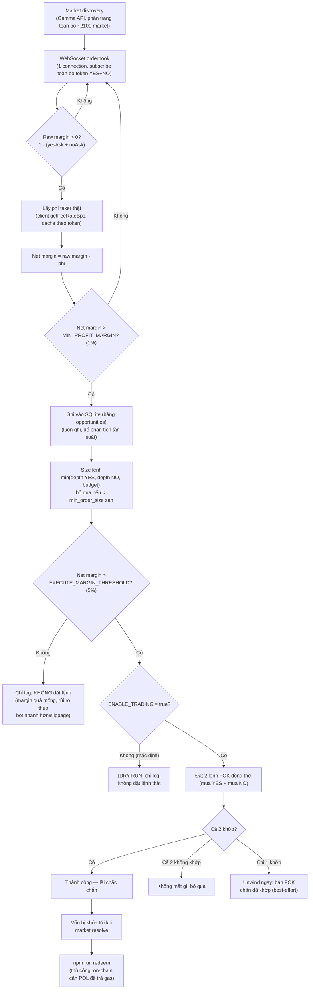

# Chiến lược của bot

## Mục tiêu

Khai thác **arbitrage phi rủi ro (risk-free arbitrage)** trong nội bộ từng
market nhị phân (YES/NO) trên Polymarket, khi `giá YES + giá NO < 1`.

**Vì sao chắc lãi**: mỗi market binary luôn resolve về đúng 1 trong 2 kết
quả. Mua 1 share YES + 1 share NO cùng lúc với tổng giá < $1 → dù kết quả
là gì, tổng thu về luôn đúng $1 (1 bên đổi $1, bên kia $0) → lãi chắc chắn
= `1 - (giá YES + giá NO) - phí`, không phụ thuộc đoán đúng/sai sự kiện.

## Sơ đồ luồng xử lý



## Giải thích từng bước

**1. Market discovery** ([src/markets.ts](src/markets.ts))
Lấy toàn bộ market đang mở qua Gamma API, phân trang (API giới hạn cứng
100/request). Chạy 1 lần lúc khởi động.

**2. Theo dõi orderbook realtime** ([src/orderbookStore.ts](src/orderbookStore.ts))
Mở 1 WebSocket, subscribe tất cả token YES/NO. Polymarket **broadcast cùng
1 luồng dữ liệu cho mọi bot** — không riêng gì bot này. Khi giá đổi, xử lý
ngay (event-driven), không polling.

Lưu ý đã đo thực tế: khi subscribe ~4200 token, Polymarket gần như **không
gửi snapshot ban đầu** — hầu hết dữ liệu tới dưới dạng `price_change` (thay
đổi từng mức giá, kèm `best_ask` do server tính). Vì vậy bot áp dụng từng
thay đổi này, và tự tải snapshot đầy đủ qua REST (batch 500 token) lúc kết
nối và mỗi 10 phút. Admin panel hiển thị số book đã sync (`booksSynced`).

**3. Lọc thô rồi tính phí thật** ([src/scan.ts](src/scan.ts), [src/feeRate.ts](src/feeRate.ts))
Lọc rẻ trước (margin thô > 0) để tránh gọi API phí không cần thiết. Nếu qua
lọc, lấy phí taker **thật** của market đó (0-10%, tùy category, đỉnh ở giá
0.5) và trừ đúng vào margin.

**4. Chiến lược 2 tầng ngưỡng** ([src/config.ts](src/config.ts), [src/executor.ts](src/executor.ts))
- `MIN_PROFIT_MARGIN` (1%) — ngưỡng **ghi log**, thấp, để biết tần suất cơ
  hội thật xảy ra (dùng cho `npm run analyze`).
- `EXECUTE_MARGIN_THRESHOLD` (5%) — ngưỡng **thực thi**, cao hơn. Lý do:
  bot này không phải nhanh nhất trong cuộc đua (đo được ~250ms RTT tới
  server Polymarket từ VPS hiện tại) — margin mỏng dễ bị bot khác nhanh hơn
  ăn mất hoặc bị slippage nuốt trước khi lệnh mình kịp khớp.

**5. Định cỡ lệnh** ([src/executor.ts](src/executor.ts) `sizeOpportunity()`)
`min(depth chân YES, depth chân NO, ngân sách MAX_ORDER_SIZE_USDC)`. Bỏ qua
nếu nhỏ hơn `min_order_size` sàn quy định.

**6. Thực thi** ([src/executor.ts](src/executor.ts) `executeArb()`)
Đặt 2 lệnh **FOK (fill-or-kill)** đồng thời — khớp hết hoặc không khớp gì,
không có lệnh treo lơ lửng. Nếu chỉ 1 chân khớp (hiếm, do giá đổi giữa lúc
gửi lệnh) → unwind ngay bằng lệnh bán FOK best-effort.

**7. Dry-run mặc định** (`ENABLE_TRADING=false`)
Toàn bộ luồng chạy y hệt, chỉ khác bước 6 không gửi lệnh thật — ghi lại
"nếu trade thì lãi bao nhiêu" để đánh giá trước khi mạo hiểm vốn thật.

**8. Claim/redeem** ([src/redeem.ts](src/redeem.ts))
Sau khi market resolve, vốn không tự về — cần gọi `npm run redeem` thủ
công (giao dịch on-chain riêng biệt, cần POL trả gas, khác hệ thống CLOB
order).

## Vì sao tốc độ là lợi thế quyết định (không phải "tìm ra" cơ hội)

Dữ liệu orderbook được **broadcast công khai cho mọi bot cùng lúc** — không
ai "tìm ra" cơ hội trước ai. Cuộc đua thật sự là **ai gửi lệnh khớp tới
server trước**. Đây là lý do:
- Bot đã dùng WebSocket (không polling), gửi 2 chân đồng thời (không tuần
  tự) — tối ưu hết mức có thể ở tầng code.
- Nút thắt thật là **network RTT** (đã đo: ~250ms từ VPS hiện tại, có thể
  giảm còn ~10-30ms nếu chuyển VPS gần hạ tầng Polymarket — xem
  [README.md](README.md) mục Backlog).
- Với quy mô 1 người tự làm, khó thắng cuộc đua tốc độ trực diện với quỹ/
  team chuyên nghiệp có hạ tầng đặt cạnh server. Hướng đi thực tế hơn:
  **market ít thanh khoản** — lời tuyệt đối nhỏ hơn nhưng ít quỹ lớn buồn
  cạnh tranh (chi phí vận hành của họ theo SỐ LƯỢNG vị thế, không theo số
  tiền, nên nhiều vị thế nhỏ không đáng công với họ nhưng đáng với bot chi
  phí vận hành gần bằng 0 như bot này).

## Mô hình điều khiển: admin panel và bot giao tiếp qua sự kiện, không qua pm2

2 process tách biệt, chung 1 file SQLite (`data/bot.db`), không gọi thẳng
nhau qua HTTP/socket:

```
Admin (không giữ private key)         Bot (giữ private key, thực thi)
       │                                       │
  Ghi 1 dòng vào bảng "commands" ────► poll mỗi 1s, validate lại,
  (set_config / pause / resume /        thực thi, ghi kết quả ngược lại
   stop / start / redeem)                       │
       │                                       │
       └──────────── data/bot.db (SQLite, WAL) ─┘
```

**Nguyên tắc cốt lõi**: admin **chỉ được phép "yêu cầu"**, không bao giờ tự
thực thi trực tiếp — kể cả với `stop`/`start`. Điều này khác với thiết kế
ban đầu (đã thử rồi bỏ): admin gọi thẳng API của pm2 để start/stop tiến
trình OS. Lý do bỏ: phá vỡ ranh giới tin cậy duy nhất của hệ thống (admin
không có quyền hành động, chỉ có quyền yêu cầu) chỉ để tiện, trong khi
mô hình event thuần nhất quán hơn và admin không cần thêm quyền hạn nào.

**`stop`/`start` khác `pause`/`resume` thế nào**:
- `pause`/`resume` — nông: vẫn giữ WebSocket kết nối, vẫn quét orderbook
  bình thường, chỉ bỏ qua bước đặt lệnh thật.
- `stop`/`start` — sâu hơn: `stop` khiến bot **ngắt hẳn WebSocket, dừng
  quét hoàn toàn**, chỉ giữ lại vòng lặp nhẹ (poll bảng `commands` mỗi
  1 giây) để còn "nghe" được lệnh `start` trong tương lai. `start` build
  lại toàn bộ: tải lại danh sách market, mở lại WebSocket, quét từ đầu.

**Giới hạn vật lý phải chấp nhận**: nếu tiến trình OS của bot thật sự chết
hẳn (crash, hoặc bị `pm2 stop` từ tầng hệ điều hành), nó không còn sống để
đọc bất kỳ event nào — event-queue chỉ hoạt động khi có ít nhất 1 bên đang
chạy để lắng nghe. `pm2` vẫn giữ vai trò **duy nhất**: tự khởi động lại
tiến trình nếu nó crash thật (`autorestart`), không liên quan gì tới việc
điều khiển stop/start theo ý người vận hành — 2 việc này tách bạch hoàn
toàn. Trạng thái `running` (đã `stop` hay chưa) được lưu lại, nên nếu pm2
phải khởi động lại do crash, bot boot lên **đúng trạng thái người vận hành
để lại** (nếu đã `stop` trước đó, boot lên ở chế độ idle, không tự ý kết
nối lại) thay vì âm thầm đè lên quyết định của operator.

Xem [README.md](README.md) để biết trạng thái hiện tại và cách dùng admin panel.
